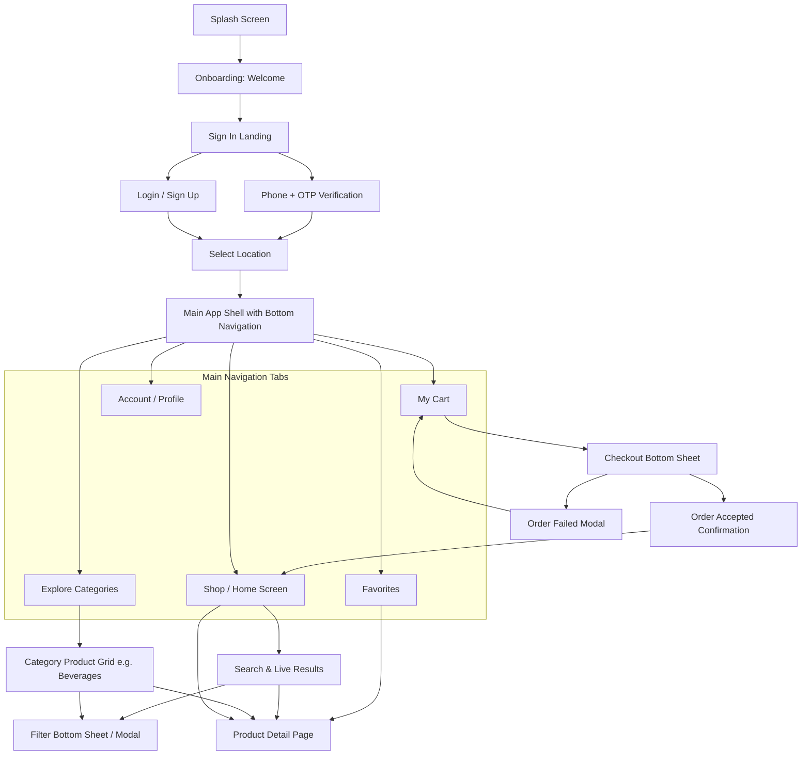

# FreshCart / Nectar — Design Analysis & Architecture Mapping

Comprehensive analysis of all 28 reference images in `public/design-reference/` based on the mobile-first Figma UI kit.

---

## 1. Complete List of Reference Files & Classification

| File Name | Category | Description |
|-----------|----------|-------------|
| `splash Screen.png` | Screen | Green brand splash screen with carrot logo and "nectar / online groceriet" |
| `onbording .png` | Screen | Full-screen image onboarding with "Welcome to our store" and "Get Started" CTA |
| `Sing in .png` | Screen | Social sign-in landing page ("Get your groceries with nectar" + Phone, Google, FB) |
| `Number.png` | Screen | Phone number entry keypad screen (+880 flag selector) |
| `Verification .png` | Screen | 4-digit OTP code verification screen with numeric keypad |
| `select location.png` | Screen | Location selection screen (Map pin illustration, Zone dropdown, Area dropdown) |
| `log in.png` | Screen | Email/password login screen with carrot icon, show/hide password, signup link |
| `sign up.png` | Screen | Registration screen (Username, Email with checkmark, Password, Terms agreement) |
| `Home Screen.png` | Screen (Tab: Shop) | Main home feed: Location bar, Search input, Hero promo banner, Exclusive Offer carousel, Best Selling carousel, Groceries categories grid/list |
| `Explore.png` | Screen (Tab: Explore) | Category discovery grid with search bar and 2-column colored cards |
| `Beverages.png` | Screen | Category product listing page with back button, category title, filter icon, 2-column product grid |
| `Search.png` | Screen | Search results screen with active search query chip ("Egg"), clear button, filter button, 2-column product grid |
| `filters.png` | Screen / Modal | Filter modal/sheet: Categories checkboxes, Brand checkboxes, "Apply Filter" CTA |
| `Product Detail.png` | Screen | Product details: Image carousel with dots, title, unit, quantity stepper (+/-), price, favorite heart toggle, expandable accordion sections (Product Detail, Nutrition, Reviews with 5-star rating), "Add To Basket" sticky CTA |
| `My Cart.png` | Screen (Tab: Cart) | Cart screen: List of items with image, name, unit/price, quantity stepper, remove (X) button, sticky "Go to Checkout" button with total badge |
| `Favorites.png` | Screen (Tab: Favourite) | Favorites list: List of saved items with image, name, unit/price, chevron arrow, sticky "Add All To Cart" CTA |
| `Checkout.png` | Modal / Bottom Sheet | Checkout summary sheet: Delivery method, Payment (Mastercard), Promo Code, Total Cost ($13.97), Terms text, "Place Order" CTA |
| `Checkout card.png` | Modal Crop | Cropped state of the Checkout bottom sheet component |
| `order accepted.png` | Screen / Modal | Order success state: Animated green checkmark badge with confetti, order text, "Track Order" primary button, "Back to home" secondary text button |
| `error.png` | Screen / Modal | Order failure state: Grocery bag illustration, "Oops! Order Failed", "Please Try Again" button, "Back to home" button |
| `bottom bar.png` | Navigation Reference | Bottom navigation bar with Shop tab active |
| `bottom bar-1.png` | Navigation Reference | Bottom navigation bar with Explore tab active |
| `bottom bar-2.png` | Navigation Reference | Crop of bottom bar state |
| `bottom bar-3.png` | Navigation Reference | Bottom navigation bar with Cart tab active |
| `bottom bar-4.png` | Navigation Reference | Bottom navigation bar with Favourite tab active |
| `bottom bar-5.png` | Navigation Reference | Bottom navigation bar with Account tab active |
| `bottom bar-6.png` | Navigation Reference | Bottom navigation bar active indicator reference |
| `bottom bar-7.png` | Navigation Reference | Bottom navigation bar state reference |

---

## 2. User Flow & Screen Hierarchy

---

## 3. Actual Screens vs. Modal Overlays vs. Navigation References

### A. Full Route Screens
1. **Onboarding / Welcome**: Full-height landing page (`/welcome`)
2. **Location Selection**: Zone & Area dropdowns (`/select-location`)
3. **Shop (Home)**: Primary discovery dashboard (`/` or `/shop`)
4. **Explore**: Category grid (`/explore`)
5. **Category Product Listing**: Filterable product grid for a specific category (`/category/:id`)
6. **Search**: Search query view with live filtering (`/search`)
7. **Product Details**: Deep product view with image preview and accordions (`/product/:id`)
8. **Cart**: Cart items, quantity controls, and checkout entry (`/cart`)
9. **Favorites**: Wishlisted products and bulk add-to-cart (`/favorites`)
10. **Account**: User profile and order history (`/account`)
11. **Order Success**: Post-checkout confirmation (`/order-success`)

### B. Modal Overlays & Bottom Sheets
1. **Checkout Sheet**: Sliding drawer from bottom over cart screen with delivery, payment, promo code, and total.
2. **Filters Sheet**: Sliding drawer or modal with Category and Brand checkboxes.
3. **Order Failed Dialog**: Centered modal popup with retry and back-to-home actions.

### C. State / Subcomponent References
- `bottom bar.png` through `bottom bar-7.png`: Visual states of the 5-tab bottom navigation showing active state (green `#53B175` icon + text) vs inactive state (dark charcoal `#181725` icon + text).

---

## 4. Reusable React Component Candidates

1. **`AppLayout`**: Outer container with responsive constraints (max-w-md on mobile, clean responsive container on desktop), top status/header area, and bottom navigation bar.
2. **`BottomNav`**: Persistent 5-tab bar (`Shop`, `Explore`, `Cart`, `Favourite`, `Account`) with active indicator and cart item badge.
3. **`Header` / `NavBar`**: Dynamic header supporting back arrow, title, search trigger, location display, or filter action icon.
4. **`SearchBar`**: Rounded search input container with search icon, clear button (`X`), and keyboard focus states.
5. **`ProductCard`**: Vertical card showing product thumbnail, name, unit/weight, price, and green `+` add-to-cart button.
6. **`CategoryCard`**: Colorful tile with category illustration, title, rounded border, and pastel background tint.
7. **`QuantityStepper`**: Reusable `-` `[number]` `+` component with rounded border container for quantity adjustments.
8. **`Button`**: Primary green rounded CTA button (`#53B175`), secondary ghost/outline button, and icon button.
9. **`BottomSheet` / `Modal`**: Slide-up sheet with backdrop blur/dim, handle/close button, and scrollable body.
10. **`Checkbox`**: Custom rounded-rect green checkmark control for category and brand filtering.
11. **`Accordion`**: Expandable disclosure item for product details, nutrition, and reviews.
12. **`RatingStars`**: 5-star rating renderer (filled orange/gold stars).

---

## 5. Component Deep Dive & UI Specifications

### Product Card Structure
- **Container**: White background, `1px solid #E2E2E2` border, `rounded-[18px]`, padding `15px`.
- **Image**: Centered product image (~100px height), object-contain.
- **Title**: `16px` bold font (`#181725`), truncated or 2-line clamp.
- **Unit / Weight**: `14px` regular font (`#7C7C7C`), e.g., `"1kg, Price"`, `"7pcs, Price"`.
- **Footer Row**: Flex row with space-between:
  - **Price**: `18px` bold (`#181725`), e.g., `"$4.99"`.
  - **Action**: `45px x 45px` rounded square button (`rounded-[17px]`), green background (`#53B175`), white `+` icon.

### Category Card Structure
- **Container**: Rounded rectangle (`rounded-[18px]`), `1px solid` matching tinted border, pastel background color (e.g. green, orange, pink, purple, yellow, blue).
- **Image**: Centered category hero illustration (~70px height).
- **Title**: Centered bold text (`16px`, `#181725`), multi-line centered.

### Header & Navigation Structure
- **Home Header**: Centered carrot logo + location pin with text `"Dhaka, Banassre"`.
- **Inner Header**: Back chevron icon on left, bold centered title (`18px-20px`), right action icon (e.g. filter slider icon or share icon).
- **Bottom Navigation**: Fixed to bottom, white background, top border/shadow, 5 items (`Shop`, `Explore`, `Cart`, `Favourite`, `Account`). Active item has `#53B175` color.

### Search & Filter UI
- **Search Bar**: Background `#F2F3F2`, `rounded-[15px]`, search icon on left, placeholder `"Search Store"`. Active search mode shows cross icon on right.
- **Filter Sheet**:
  - Close `X` icon on top left, title `"Filters"` centered.
  - Section headers: `"Categories"`, `"Brand"`.
  - Items: Custom square checkbox with checkmark (`#53B175` when checked) + label.
  - Sticky button: `"Apply Filter"` full-width green button at bottom.

### Cart & Checkout UI
- **Cart Item Row**:
  - Image (`60-70px`) on left.
  - Middle: Item name (`16px` bold), unit subtitle (`14px` gray), quantity stepper (`- 1 +`).
  - Right: Close `X` button (top right), line total price (`18px` bold, bottom right).
  - Divider: Thin line `#E2E2E2` between rows.
- **Cart CTA**: Sticky bottom button `"Go to Checkout"` with embedded price badge (e.g., `"$12.96"` in translucent pill on right).
- **Checkout Sheet**:
  - Header: `"Checkout"` title with `X` dismiss button.
  - List items: `Delivery` ("Select Method" >), `Payment` (Card icon >), `Promo Code` ("Pick discount" >), `Total Cost` ("$13.97" >).
  - Terms: `"By placing an order you agree to our Terms and Conditions"`.
  - Action: Full-width green `"Place Order"` button.

### Order Feedback UI
- **Success (`order accepted.png`)**:
  - Centered illustration: Large green circle with white checkmark + colorful confetti particles.
  - Heading: `"Your Order has been accepted"`.
  - Subtitle: `"Your items has been placed and is on it's way to being processed"`.
  - Primary button: `"Track Order"`.
  - Secondary button: `"Back to home"`.
- **Failure (`error.png`)**:
  - Centered illustration: Grocery bag with vegetables in circular mint background.
  - Heading: `"Oops! Order Failed"`.
  - Subtitle: `"Something went tembly wrong."`.
  - Primary button: `"Please Try Again"`.
  - Secondary button: `"Back to home"`.

---

## 6. Design System Tokens

### Color Palette
- **Primary / Brand Green**: `#53B175` (Buttons, active icons, tags, accents)
- **Primary Dark**: `#489E67` (Hover/active states)
- **Dark Charcoal (Text Primary)**: `#181725` (Headings, product titles, prices)
- **Gray Neutral (Text Secondary)**: `#7C7C7C` (Units, subtitles, descriptions)
- **Border Gray**: `#E2E2E2` / `#F1F1F1` (Card borders, dividers)
- **Input / Search Background**: `#F2F3F2`
- **Surface / Background**: `#FFFFFF` & `#FCFCFC`
- **Error / Danger**: `#F3603F`
- **Star Rating Orange**: `#F3603F` / `#F8A44C`
- **Category Card Pastels**:
  - Fruits & Veg: `#EEF7F1` (Border: `#53B17580`)
  - Cooking Oil: `#FDF6E7` (Border: `#F8A44C80`)
  - Meat & Fish: `#FDE8E4` (Border: `#F7A593`)
  - Bakery & Snacks: `#F4EBF7` (Border: `#D3B0E0`)
  - Dairy & Eggs: `#FFF8E5` (Border: `#FDE598`)
  - Beverages: `#EDF7FC` (Border: `#B7DFF5`)

### Typography Hierarchy
- **Font Family**: Clean geometric sans-serif (e.g. `Gilroy`, `Inter`, or `system-ui`)
- **Display / Hero Title**: `28px` - `24px` | Bold (`font-bold` / 700)
- **Screen Header / Title**: `20px` | Bold / SemiBold (600)
- **Section Heading**: `20px` - `24px` | SemiBold / Bold
- **Product Title**: `16px` | Bold / Medium
- **Body / Description**: `14px` - `16px` | Regular (`text-gray-500` / 400)
- **Captions / Unit Subtitles**: `13px` - `14px` | Regular / Medium
- **Button Text**: `18px` | SemiBold (600)

### Spacing & Grid System
- **Screen Horizontal Padding**: `16px` - `20px` (`px-4` or `px-5`)
- **Card Spacing**: `12px` - `16px` gap in 2-column grid (`grid-cols-2 gap-4`)
- **Section Spacing**: `24px` - `30px` vertical margin between homepage sections
- **Bottom Navigation Height**: `65px` - `75px` with safe area bottom padding

### Border Radii
- **Full Buttons**: `rounded-[19px]` / `rounded-2xl`
- **Product & Category Cards**: `rounded-[18px]`
- **Search Bar / Input Fields**: `rounded-[15px]`
- **Quantity Stepper / Action Buttons**: `rounded-[14px]` - `rounded-[17px]`
- **Bottom Sheet Top Corners**: `rounded-t-[30px]`

---

## 7. Responsive & Layout Strategy

### Mobile-First Layout
- Native viewport target: `375px` to `430px` width.
- Single column feed on homepage with horizontal carousels for `"Exclusive Offer"` and `"Best Selling"`.
- 2-column grid for `"Explore"`, `"Beverages"`, and `"Search"` screens.
- Fixed bottom navigation bar with `pb-safe` for mobile devices.
- Slide-up bottom sheets for Checkout and Filters.

### Desktop Adaptation Strategy
- **Container Constraint**: Centered container max-width (`max-w-md` for strict app view, or expanded adaptive layout `max-w-5xl` with sidebar navigation for tablet/desktop).
- **Navigation Adaptation**: Bottom bar transforms into clean top/sidebar navigation on larger screens.
- **Grids**: Expand from 2 columns to 3-4 columns on desktop viewports.
- **Modals**: Bottom sheets become centered modal dialogs on desktop.

---

## 8. Asset Inventory

### A. Product Images
| Asset Name | Product | Status in Ref / Strategy |
|------------|---------|--------------------------|
| `organic-bananas.png` | Organic Bananas | Available in `Home Screen.png` & `My Cart.png` -> Extract / Recreate asset |
| `red-apple.png` | Red Apple | Available in `Home Screen.png` & `Product Detail.png` -> Extract / Recreate asset |
| `bell-pepper-red.png` | Bell Pepper Red | Available in `Home Screen.png` & `My Cart.png` -> Extract / Recreate asset |
| `ginger.png` | Ginger | Available in `Home Screen.png` & `My Cart.png` -> Extract / Recreate asset |
| `beef-bone.png` | Beef Bone | Available in `Home Screen.png` -> Extract / Recreate asset |
| `broiler-chicken.png` | Broiler Chicken | Available in `Home Screen.png` -> Extract / Recreate asset |
| `egg-chicken-red.png` | Egg Chicken Red | Available in `Search.png` & `My Cart.png` -> Extract / Recreate asset |
| `diet-coke.png` | Diet Coke | Available in `Beverages.png` & `Favorites.png` -> Extract / Recreate asset |
| `sprite-can.png` | Sprite Can | Available in `Beverages.png` & `Favorites.png` -> Extract / Recreate asset |
| `apple-grape-juice.png` | Apple & Grape Juice | Available in `Beverages.png` & `Favorites.png` -> Extract / Recreate asset |
| `orange-juice.png` | Orange Juice | Available in `Beverages.png` -> Extract / Recreate asset |
| `coca-cola-can.png` | Coca Cola Can | Available in `Beverages.png` & `Favorites.png` -> Extract / Recreate asset |
| `pepsi-can.png` | Pepsi Can | Available in `Beverages.png` & `Favorites.png` -> Extract / Recreate asset |

### B. Category Images
| Asset Name | Category | Status / Strategy |
|------------|----------|-------------------|
| `fruits-vegetables.png` | Fresh Fruits & Vegetable | Available in `Explore.png` -> Extract / Recreate |
| `cooking-oil.png` | Cooking Oil & Ghee | Available in `Explore.png` -> Extract / Recreate |
| `meat-fish.png` | Meat & Fish | Available in `Explore.png` -> Extract / Recreate |
| `bakery-snacks.png` | Bakery & Snacks | Available in `Explore.png` -> Extract / Recreate |
| `dairy-eggs.png` | Dairy & Eggs | Available in `Explore.png` -> Extract / Recreate |
| `beverages.png` | Beverages | Available in `Explore.png` -> Extract / Recreate |
| `pulses.png` | Pulses | Available in `Home Screen.png` -> Extract / Recreate |
| `rice.png` | Rice | Available in `Home Screen.png` -> Extract / Recreate |

### C. Banner Images
| Banner Name | Screen | Status / Strategy |
|-------------|--------|-------------------|
| `fresh-vegetables-banner.png` | Home Screen hero | Promo banner with fresh vegetables and "Get Up To 40% OFF" -> Extract / Recreate |

### D. Illustrations
| Illustration | Screen | Strategy |
|--------------|--------|----------|
| Carrot Brand Logo | Splash, Auth, Home | SVG Component / Icon |
| Welcome Onboarding Hero | Onboarding | Photo asset / Illustration |
| Location Map Pin Pinboard | Select Location | SVG / Illustrated Map Graphic |
| Order Success Confetti Badge | Order Accepted | Pure CSS / SVG Animated Checkmark + Confetti |
| Order Failed Bag Graphic | Error Dialog | SVG / Illustrated Bag Graphic |

### E. UI Icons (Representable via Pure SVG / CSS)
- **Bottom Nav**: `Shop` (storefront), `Explore` (magnifier + list), `Cart` (trolley), `Favourite` (heart outline), `Account` (user profile).
- **Controls**: `Search` (magnifying glass), `Close` (`X`), `Back` (chevron left), `Forward` (chevron right), `Filter` (equalizer sliders), `Plus` (`+`), `Minus` (`-`), `Heart` (filled/outline), `Share` (upload tray), `Dropdown` (chevron down), `Checkmark` (checkmark), `Star` (rating star).
- **Payment Logos**: Mastercard icon, Apple Pay, Cash on delivery icons.
